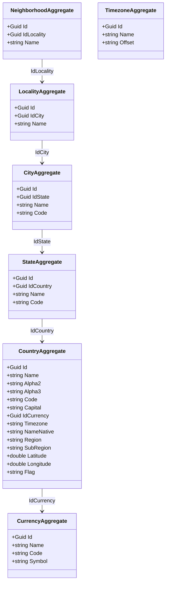
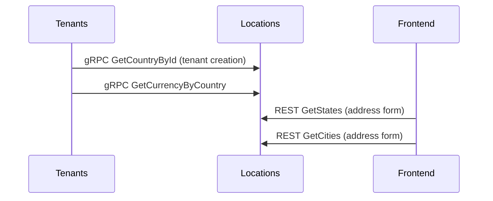

# Locations Microservice

## Overview

The Locations microservice is the authoritative source for geographic reference data within the platform. It manages a hierarchical catalog of countries, states, cities, localities, neighborhoods, regions, currencies, and timezones. This data is used during tenant creation to configure location-specific settings (currency, timezone, tax jurisdiction) and by any microservice that needs to display or validate geographic information. It provides gRPC endpoints for cached lookups, ensuring fast resolution of location data without REST overhead.

## Business Context

A multi-country SaaS platform needs standardized geographic data for multiple purposes: determining which currency to use for billing, selecting the correct timezone for date calculations, populating address forms with valid options, and configuring country-specific regulatory metadata. Without a centralized location service, each microservice would maintain its own geographic data, leading to inconsistencies and maintenance burden when political boundaries change.

The Locations microservice solves this by maintaining a single, curated geographic database that all other services reference. Countries include ISO 3166 codes, currencies, timezones, and geospatial coordinates. The hierarchical model (Country > State > City > Locality > Neighborhood) supports address validation at any granularity level required by the business.

For a new developer: this is the "atlas" of the platform. Whenever any part of the system needs to know about countries, cities, currencies, or timezones, it queries here.

## Ubiquitous Language

| Term          | Definition                                                                                                                          |
| ------------- | ----------------------------------------------------------------------------------------------------------------------------------- |
| Country       | A sovereign nation identified by ISO 3166 codes (Alpha2, Alpha3, numeric). Carries currency, timezone, region, and coordinates.     |
| State         | A first-level administrative division within a country (department, province, state).                                                |
| City          | A populated place within a state. The most commonly used level for address purposes.                                                 |
| Locality      | A subdivision within a city (borough, district, comuna). Used in countries with complex urban divisions.                             |
| Neighborhood  | The most granular geographic level. A named area within a locality or city.                                                          |
| Region        | A continental or sub-continental grouping (e.g., "Americas", "Europe", "Asia").                                                      |
| SubRegion     | A more specific geographic grouping within a region (e.g., "South America", "Western Europe").                                       |
| Currency      | A monetary unit identified by ISO 4217 code (e.g., "COP", "USD", "EUR"). Linked to countries.                                       |
| Timezone      | An IANA timezone identifier (e.g., "America/Bogota", "Europe/London") associated with a country.                                     |
| Alpha2        | ISO 3166-1 alpha-2 country code (e.g., "CO" for Colombia, "US" for United States).                                                   |
| Alpha3        | ISO 3166-1 alpha-3 country code (e.g., "COL", "USA").                                                                                |
| Code          | ISO 3166-1 numeric country code (e.g., "170" for Colombia).                                                                          |
| Capital       | The capital city of a country (informational, not a foreign key to the City aggregate).                                              |
| NameNative    | The country name in its native language/script.                                                                                       |
| Flag          | An emoji or URL representing the country's flag for UI display.                                                                       |
| Latitude      | Geographic latitude coordinate of the country centroid (validated -90 to 90).                                                         |
| Longitude     | Geographic longitude coordinate of the country centroid (validated -180 to 180).                                                      |
| CityCurrency  | A junction aggregate linking cities to currencies when a city uses a different currency than its country default.                      |

## Domain Model

The Locations domain is organized around multiple aggregates representing the geographic hierarchy. Each level references its parent via a foreign key. The `CountryAggregate` is the root of the hierarchy and carries the most metadata. `CurrencyAggregate` and `TimezoneAggregate` are independent reference data.



## Data Dictionary

### CountryAggregate

The root geographic entity with full ISO metadata.

| Field      | Type   | Description                                             |
| ---------- | ------ | ------------------------------------------------------- |
| Id         | Guid   | Unique identifier                                       |
| Name       | string | English country name                                    |
| Alpha2     | string | ISO 3166-1 alpha-2 code (e.g., "CO")                   |
| Alpha3     | string | ISO 3166-1 alpha-3 code (e.g., "COL")                  |
| Code       | string | ISO 3166-1 numeric code (e.g., "170")                   |
| Capital    | string?| Capital city name (informational)                       |
| IdCurrency | Guid   | Reference to the country's default currency             |
| Timezone   | string | IANA timezone identifier                                |
| NameNative | string | Country name in native language                         |
| Region     | string | Continental region (e.g., "Americas")                   |
| SubRegion  | string | Sub-continental region (e.g., "South America")          |
| Latitude   | double | Centroid latitude (-90 to 90)                           |
| Longitude  | double | Centroid longitude (-180 to 180)                        |
| Flag       | string?| Flag emoji or URL                                       |
| IsActive   | bool   | Whether the country is available for selection           |

### CurrencyAggregate

Monetary units used across the platform.

| Field  | Type   | Description                            |
| ------ | ------ | -------------------------------------- |
| Id     | Guid   | Unique identifier                      |
| Name   | string | Currency name (e.g., "Colombian Peso") |
| Code   | string | ISO 4217 code (e.g., "COP")           |
| Symbol | string | Currency symbol (e.g., "$")            |

## Integration Architecture

Locations is a read-heavy reference data service. It provides gRPC endpoints for fast cached lookups used during tenant creation, address form population, and currency resolution. It does not consume events from other microservices.



## API Reference

Base path: `/api`

### Countries

| Method | Path                  | Description                          | Auth    |
| ------ | --------------------- | ------------------------------------ | ------- |
| GET    | `/api/Country`        | Paginated list of countries          | Bearer  |
| GET    | `/api/Country/{id}`   | Get a country by ID                  | Bearer  |
| POST   | `/api/Country`        | Create a country                     | Bearer  |
| PUT    | `/api/Country/{id}`   | Update a country                     | Bearer  |
| DELETE | `/api/Country/{id}`   | Delete a country                     | Bearer  |

### States, Cities, Localities, Neighborhoods

Each level follows the same CRUD pattern with parent filtering support.

| Method | Path                       | Description                     | Auth    |
| ------ | -------------------------- | ------------------------------- | ------- |
| GET    | `/api/State`               | List states (filter by country) | Bearer  |
| GET    | `/api/City`                | List cities (filter by state)   | Bearer  |
| GET    | `/api/Locality`            | List localities (filter by city)| Bearer  |
| GET    | `/api/Neighborhood`        | List neighborhoods              | Bearer  |

### Currencies and Timezones

| Method | Path                 | Description              | Auth    |
| ------ | -------------------- | ------------------------ | ------- |
| GET    | `/api/Currency`      | List all currencies      | Bearer  |
| GET    | `/api/Timezone`      | List all timezones       | Bearer  |

### gRPC Services

| Service          | Method              | Description                             |
| ---------------- | ------------------- | --------------------------------------- |
| LocationService  | GetCountryById      | Cached country lookup                   |
| LocationService  | GetStatesByCountry  | States for a given country              |
| LocationService  | GetCitiesByState    | Cities for a given state                |
| LocationService  | GetCurrencyById     | Currency details by ID                  |

## Key Design Decisions

- **Hierarchical aggregates:** Each geographic level is its own aggregate with a parent reference, enabling independent lifecycle management and granular queries.

- **Coordinate validation:** Latitude and longitude are validated at the domain level (-90/90 and -180/180 respectively), preventing invalid geospatial data.

- **gRPC for cached lookups:** Locations data changes infrequently but is queried constantly. The gRPC interface enables binary-efficient cached reads from consuming services.

- **No tenant scoping:** Geographic data is global platform infrastructure, not tenant-specific. All tenants share the same location catalog.

- **ISO standard compliance:** Countries use ISO 3166 codes, currencies use ISO 4217. This ensures interoperability with external systems.

- **Seed data architecture:** The geographic database is populated via seed scripts rather than user input, ensuring data quality and consistency.

## Seed Data Generator

The microservice includes a console app (`tools/SeedGenerator/`) that generates seed JSON files from authoritative external sources.

### How to run

```bash
cd tools/SeedGenerator
dotnet run
```

This generates 6 JSON files in `src/domain/.../Infrastructure/Seeds/`:

| File | Records | Source |
|------|---------|--------|
| seed-currencies.json | 162 | ISO 4217 via [mledoze/countries](https://github.com/mledoze/countries) |
| seed-countries.json | 250 | ISO 3166 via [mledoze/countries](https://github.com/mledoze/countries) |
| seed-co-states.json | 33 | DANE (datos.gov.co/resource/gdxc-w37w) |
| seed-co-cities.json | 1122 | DANE (datos.gov.co/resource/gdxc-w37w) |
| seed-co-localities.json | 214 | Built-in (18 major cities with comunas) |
| seed-co-neighborhoods.json | 1724 | Datos Abiertos Bogota (barriolegalizado.json) |

### How it works

1. Fetches all countries + currencies from GitHub (mledoze/countries - ISO data)
2. Fetches all Colombian departments and municipalities from DANE open data API
3. Generates localities for 18 major Colombian cities (built-in data)
4. Downloads Bogota's official GeoJSON of legalized neighborhoods (1724 barrios with locality codes)
5. The `LocationSeedService` (BackgroundService) loads these JSONs at startup and inserts into MongoDB if empty

### Current coverage

| Level | Colombia | Global |
|-------|----------|--------|
| Countries | 1 (Colombia) | 250 (all) |
| States/Departments | 33 (all DANE) | Only Colombia |
| Cities/Municipalities | 1122 (all DANE) | Only Colombia |
| Localities/Comunas | 214 (18 cities) | Only Colombia |
| Neighborhoods/Barrios | 1724 (Bogota only) | Only Bogota |

### TODOs

- [ ] Add localities (comunas) for remaining cities with >200k inhabitants (~30 more cities: Soacha, Bello, Envigado, Itagui, Floridablanca, Soledad, Dosquebradas, Palmira, Tunja, etc.)
- [ ] Add neighborhoods for other major cities (Medellin, Cali, Barranquilla) when open data APIs are available
- [ ] Add states/cities for other Latin American countries (Mexico, Peru, Chile, etc.) from their respective census APIs
- [ ] Add timezones to countries (currently defaulting to "UTC" — mledoze/countries doesn't include timezone data)
- [ ] Consider fetching from an alternative API that includes timezones (e.g., restcountries.com when available)
- [ ] Evaluate adding DANE codes as City.Code field for municipality identification
- [ ] Add postal codes when source data is available

### External data sources

| Source | URL | Data |
|--------|-----|------|
| mledoze/countries | github.com/mledoze/countries | ISO 3166 countries + ISO 4217 currencies |
| DANE Colombia | datos.gov.co/resource/gdxc-w37w | All departments + municipalities |
| Datos Abiertos Bogota | datosabiertos.bogota.gov.co | Barrios legalizados GeoJSON |

## Related Microservices

| Microservice | Direction | Integration Point                                                   |
| ------------ | --------- | ------------------------------------------------------------------- |
| Tenants      | Outbound  | Queries location data during tenant creation for currency/timezone   |
| Invoicing    | Outbound  | References currency codes for monetary calculations                  |
| Catalogs     | Reference | Document types may reference country-specific configurations         |
